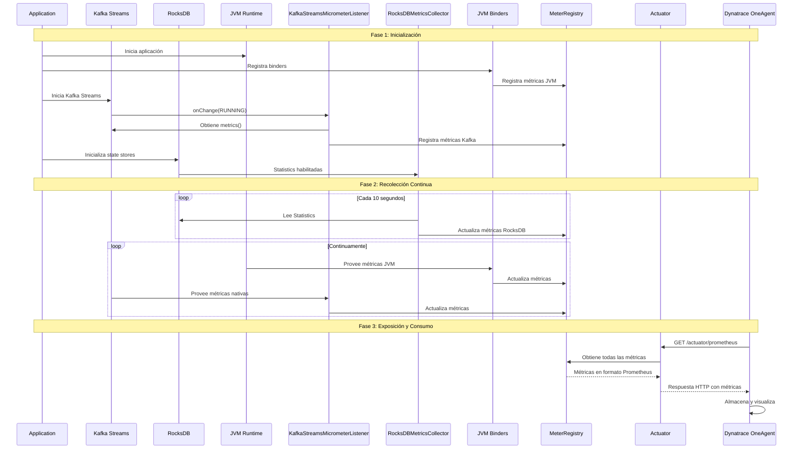
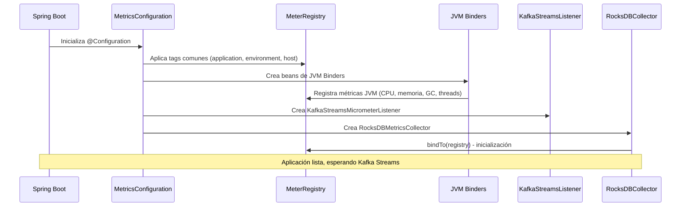
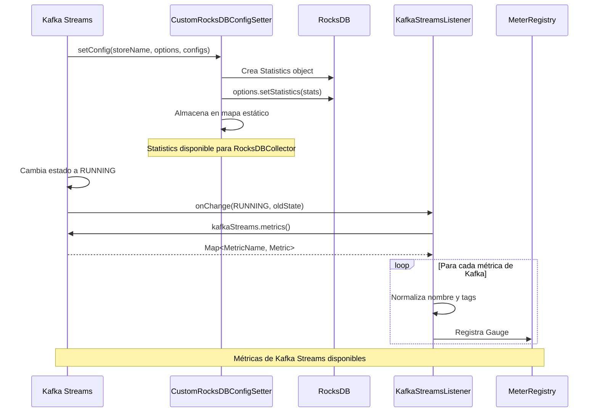
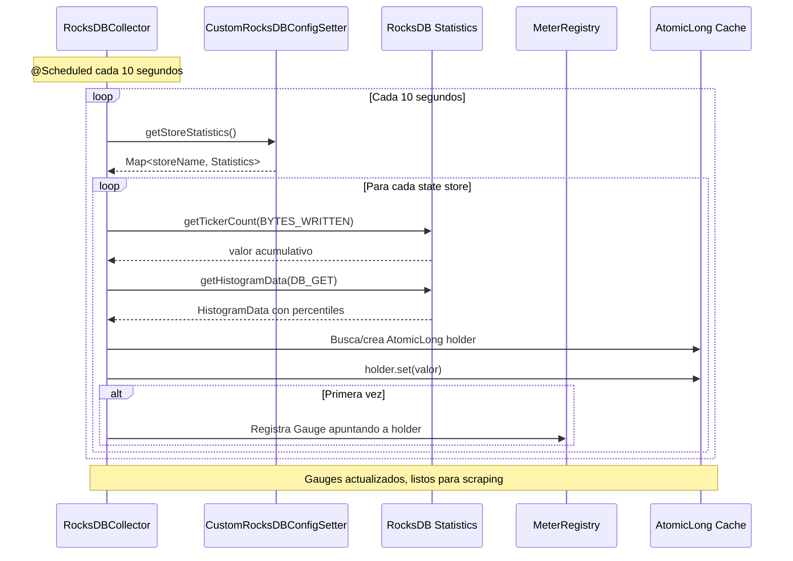
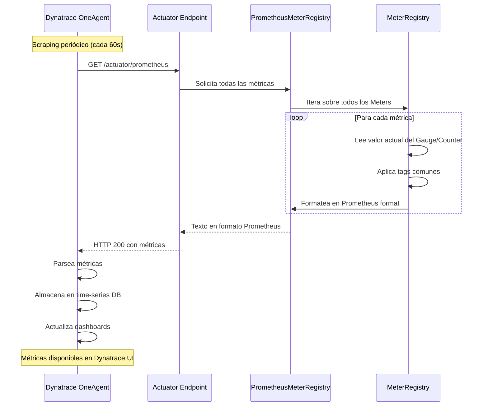
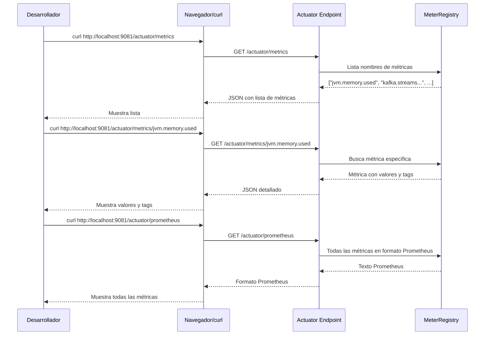

# Arquitectura de Observabilidad con Dynatrace

## Resumen Ejecutivo

Esta solución integra observabilidad exhaustiva en una aplicación Spring Boot 3 con Kafka Streams, exponiendo métricas de JVM, Kafka Streams y RocksDB mediante Micrometer y Spring Boot Actuator. Las métricas se exponen en formato Prometheus para que Dynatrace OneAgent las recolecte automáticamente en GKE, y también están disponibles para inspección local durante el desarrollo.

### Características Implementadas

1. **Métricas de JVM**: CPU, memoria (heap/non-heap), hilos, garbage collection, y class loading
2. **Métricas de Kafka Streams**: Throughput, latencia, consumer lag, estado de threads, tareas activas, y operaciones de repartitioning
3. **Métricas de RocksDB**: Uso de memoria (MemTable, Block Cache), operaciones de lectura/escritura, latencia, y compactación
4. **Exposición de Métricas**: Endpoints HTTP vía Spring Boot Actuator en formato Prometheus
5. **Etiquetado Consistente**: Tags comunes en todas las métricas para facilitar filtrado y agrupación
6. **Manejo de Errores Resiliente**: La recolección de métricas no afecta la funcionalidad principal de la aplicación

### Problema que Resuelve

Antes de esta implementación, la aplicación carecía de visibilidad sobre:
- El estado interno de la JVM (uso de memoria, GC, threads)
- El rendimiento de Kafka Streams (throughput, latencia, lag)
- El comportamiento de los state stores de RocksDB (memoria, operaciones, compactación)

Esta falta de observabilidad dificultaba:
- Detectar problemas de rendimiento antes de que afecten a usuarios
- Optimizar la configuración de recursos (memoria, CPU)
- Diagnosticar cuellos de botella en el procesamiento de streams
- Entender el impacto de operaciones de repartitioning


## Arquitectura General

### Diagrama de Componentes

```mermaid
graph TB
    subgraph "Application Layer"
        KS[Kafka Streams Topology<br/>KeyUpperCaseTopology]
        RDB[RocksDB State Stores<br/>uppercase-storage]
        JVM[JVM Runtime<br/>Java 21]
    end
    
    subgraph "Metrics Collection Layer"
        KSML[KafkaStreamsMicrometerListener<br/>Captura métricas nativas]
        RDBCS[CustomRocksDBConfigSetter<br/>Habilita Statistics API]
        RDBMC[RocksDBMetricsCollector<br/>Recolección periódica]
        JVMB[JVM Micrometer Binders<br/>ClassLoader, Memory, GC, CPU, Threads]
    end
    
    subgraph "Metrics Registry"
        MC[MetricsConfiguration<br/>Bean central de configuración]
        MR[MeterRegistry<br/>Registro de Micrometer]
        PR[PrometheusMeterRegistry<br/>Formato Prometheus]
    end
    
    subgraph "Exposure Layer"
        ACT[Spring Boot Actuator<br/>Endpoints HTTP]
        PM[/actuator/prometheus<br/>Todas las métricas]
        ME[/actuator/metrics<br/>Métricas individuales]
    end
    
    subgraph "Collection Layer"
        LOCAL[Desarrollo Local<br/>curl, navegador]
        DTOA[Dynatrace OneAgent<br/>Scraping automático en GKE]
    end
    
    KS -->|Stream Metrics| KSML
    RDB -->|Statistics API| RDBCS
    RDBCS -->|Stats Object| RDBMC
    JVM -->|JVM Metrics| JVMB
    
    MC -->|Configura| KSML
    MC -->|Configura| RDBMC
    MC -->|Configura| JVMB
    
    KSML -->|Registra| MR
    RDBMC -->|Registra| MR
    JVMB -->|Registra| MR
    
    MR -->|Exporta| PR
    PR -->|Provee| ACT
    
    ACT -->|Sirve| PM
    ACT -->|Sirve| ME
    
    PM -->|Scrape HTTP| DTOA
    ME -->|Query HTTP| LOCAL
    
    style DTOA fill:#00a1e0
    style LOCAL fill:#90EE90
    style MC fill:#FFD700
```


### Flujo de Métricas




## Componentes Implementados

### 1. MetricsConfiguration

**Archivo**: `src/main/java/com/labs/repartitioner/config/MetricsConfiguration.java`

**Propósito**: Bean de configuración central que inicializa todos los componentes de métricas y aplica tags comunes.

**Qué Hace**:
- Configura tags comunes (`application`, `environment`, `host`) que se aplican a todas las métricas
- Registra JVM Micrometer Binders para métricas de infraestructura
- Crea y configura `KafkaStreamsMicrometerListener` para métricas de Kafka Streams
- Crea y configura `RocksDBMetricsCollector` para métricas de RocksDB
- Integra el listener con Kafka Streams mediante `BeanPostProcessor`

**Por Qué Se Implementó Así**:
- **Centralización**: Un único punto de configuración facilita el mantenimiento
- **Tags Comunes**: Aplicar tags a nivel de registry asegura consistencia en todas las métricas
- **Inyección de Dependencias**: Usar Spring beans permite testing y configuración flexible
- **BeanPostProcessor**: Necesario para integrar el listener después de que Kafka Streams se inicializa

**Beans Registrados**:
- `metricsCommonTags()`: Customizer que aplica tags comunes
- `classLoaderMetrics()`: Métricas de class loading
- `jvmMemoryMetrics()`: Métricas de memoria heap/non-heap
- `jvmGcMetrics()`: Métricas de garbage collection
- `processorMetrics()`: Métricas de CPU
- `jvmThreadMetrics()`: Métricas de threads
- `kafkaStreamsMicrometerListener()`: Listener de Kafka Streams
- `rocksDBMetricsCollector()`: Collector de RocksDB
- `kafkaStreamsListenerIntegration()`: BeanPostProcessor para integración

**Problema que Resuelve**: Sin esta configuración, las métricas no tendrían tags consistentes y sería difícil correlacionar métricas de diferentes fuentes en Dynatrace.


### 2. KafkaStreamsMicrometerListener

**Archivo**: `src/main/java/com/labs/repartitioner/metrics/KafkaStreamsMicrometerListener.java`

**Propósito**: Captura métricas nativas de Kafka Streams y las registra en Micrometer.

**Qué Hace**:
- Implementa `KafkaStreams.StateListener` para detectar cambios de estado
- Cuando Kafka Streams entra en estado `RUNNING`, accede a `kafkaStreams.metrics()`
- Itera sobre todas las métricas nativas de Kafka y las registra como Gauges en Micrometer
- Convierte tags de Kafka (topic, partition, task-id, thread-id, node-id) a tags de Micrometer
- Normaliza nombres de métricas al formato Micrometer (lowercase con puntos)

**Por Qué Se Implementó Así**:
- **StateListener**: Kafka Streams solo expone métricas después de inicializarse, por lo que necesitamos esperar al estado RUNNING
- **Gauges**: Las métricas de Kafka son valores instantáneos, no acumulativos, por lo que Gauge es el tipo apropiado
- **Conversión de Tags**: Los tags de Kafka usan guiones, Micrometer prefiere puntos, por lo que normalizamos
- **Manejo de Errores**: Try-catch en cada métrica asegura que un fallo no afecte otras métricas

**Métricas Capturadas**:
- **Throughput**: `records-consumed-rate`, `records-produced-rate`, `bytes-consumed-rate`, `bytes-produced-rate`
- **Latencia**: `process-latency-avg`, `process-latency-max`, `commit-latency-avg`, `commit-latency-max`
- **Consumer Lag**: `records-lag`, `records-lag-max`
- **Thread State**: `thread-state` (running, rebalancing, dead)
- **Tasks**: `active-tasks`, `standby-tasks`
- **Repartitioning**: Métricas con tag `node-id` identifican operaciones de repartitioning

**Problema que Resuelve**: Kafka Streams expone cientos de métricas nativas, pero no en formato Prometheus. Este listener las convierte y las hace disponibles para Dynatrace.


### 3. CustomRocksDBConfigSetter

**Archivo**: `src/main/java/com/labs/repartitioner/metrics/CustomRocksDBConfigSetter.java`

**Propósito**: Habilita la recolección de estadísticas internas de RocksDB para cada state store.

**Qué Hace**:
- Implementa `RocksDBConfigSetter` de Kafka Streams
- Cuando Kafka Streams inicializa un state store, crea un objeto `Statistics` de RocksDB
- Configura el nivel de estadísticas a `EXCEPT_DETAILED_TIMERS` (balance entre detalle y overhead)
- Almacena el objeto `Statistics` en un mapa estático para acceso externo
- Limpia el objeto `Statistics` cuando el store se cierra

**Por Qué Se Implementó Así**:
- **RocksDBConfigSetter**: Es el único mecanismo que Kafka Streams proporciona para personalizar RocksDB
- **Mapa Estático**: Necesario para que `RocksDBMetricsCollector` pueda acceder a las estadísticas desde otro bean
- **StatsLevel.EXCEPT_DETAILED_TIMERS**: Proporciona métricas útiles sin overhead excesivo
- **Cleanup en close()**: Previene memory leaks cuando los stores se cierran

**Configuración Requerida**:
```yaml
spring:
  kafka:
    streams:
      properties:
        rocksdb.config.setter: com.labs.repartitioner.metrics.CustomRocksDBConfigSetter
```

**Problema que Resuelve**: RocksDB no expone métricas por defecto. Sin habilitar Statistics, no tendríamos visibilidad sobre el comportamiento interno de los state stores (memoria, operaciones, compactación).


### 4. RocksDBMetricsCollector

**Archivo**: `src/main/java/com/labs/repartitioner/metrics/RocksDBMetricsCollector.java`

**Propósito**: Recolecta periódicamente estadísticas de RocksDB y las registra como métricas de Micrometer.

**Qué Hace**:
- Implementa `MeterBinder` para integrarse con Micrometer
- Cada 10 segundos (configurado con `@Scheduled`), accede al mapa de `Statistics` de `CustomRocksDBConfigSetter`
- Para cada state store, lee valores de tickers (contadores) e histogramas (latencias)
- Registra métricas como Gauges con tags que identifican el store (`state-store`, `column-family`)
- Usa un cache de `AtomicLong` para evitar recrear gauges en cada recolección

**Por Qué Se Implementó Así**:
- **@Scheduled**: RocksDB Statistics son acumulativas, necesitamos leerlas periódicamente
- **10 segundos**: Balance entre frescura de datos y overhead de recolección
- **Cache de AtomicLong**: Micrometer no permite actualizar gauges directamente, por lo que usamos holders mutables
- **Manejo de Errores por Store**: Si un store falla, continuamos con los demás
- **Try-Catch Granular**: Cada métrica individual tiene su propio try-catch para máxima resiliencia

**Métricas Capturadas**:
- **Memoria**: `memtable.size.all`, `block.cache.hit`, `block.cache.miss`
- **Operaciones**: `number.keys.written`, `number.keys.read`, `number.keys.updated`, `bytes.read`, `bytes.written`
- **Latencia**: `db.get.micros`, `db.write.micros` (promedio de histogramas)
- **Compactación**: `compact.write.bytes`, `compact.read.bytes`

**Problema que Resuelve**: Las estadísticas de RocksDB están en memoria pero no se exponen automáticamente. Este collector las lee y las convierte a formato Prometheus para Dynatrace.


### 5. Spring Boot Actuator Configuration

**Archivo**: `src/main/resources/application.yaml`

**Propósito**: Configurar endpoints de Actuator para exponer métricas en formato Prometheus.

**Qué Hace**:
- Habilita endpoints de Actuator: `health`, `info`, `metrics`, `prometheus`
- Configura el endpoint `/actuator/prometheus` para exportar todas las métricas en formato Prometheus
- Configura el endpoint `/actuator/metrics` para inspección individual de métricas
- Define tags comunes que se aplican a todas las métricas

**Configuración**:
```yaml
management:
  endpoint:
    metrics:
      enabled: true
    prometheus:
      enabled: true
  endpoints:
    web:
      exposure:
        include: health,info,metrics,prometheus
      base-path: /actuator
  metrics:
    export:
      prometheus:
        enabled: true
    tags:
      application: ${spring.application.name}
      environment: ${ENVIRONMENT:local}
      host: ${HOSTNAME:localhost}
```

**Por Qué Se Implementó Así**:
- **Prometheus Format**: Dynatrace OneAgent puede hacer scraping de endpoints Prometheus
- **Múltiples Endpoints**: `/metrics` para desarrollo, `/prometheus` para producción
- **Tags Externalizados**: Usar variables de entorno permite configurar tags sin recompilar
- **Base Path /actuator**: Convención estándar de Spring Boot

**Endpoints Disponibles**:
- `GET /actuator/metrics`: Lista todas las métricas disponibles
- `GET /actuator/metrics/{metricName}`: Detalle de una métrica específica con tags
- `GET /actuator/prometheus`: Todas las métricas en formato Prometheus (para Dynatrace)

**Problema que Resuelve**: Sin Actuator, las métricas de Micrometer estarían en memoria pero no serían accesibles vía HTTP. Actuator las expone para que Dynatrace pueda recolectarlas.


## Archivos Involucrados

### Archivos de Implementación

| Archivo | Propósito | Líneas de Código |
|---------|-----------|------------------|
| `src/main/java/com/labs/repartitioner/config/MetricsConfiguration.java` | Configuración central de métricas, beans de Micrometer | ~180 |
| `src/main/java/com/labs/repartitioner/metrics/KafkaStreamsMicrometerListener.java` | Captura métricas nativas de Kafka Streams | ~200 |
| `src/main/java/com/labs/repartitioner/metrics/CustomRocksDBConfigSetter.java` | Habilita Statistics API de RocksDB | ~70 |
| `src/main/java/com/labs/repartitioner/metrics/RocksDBMetricsCollector.java` | Recolecta métricas de RocksDB periódicamente | ~250 |
| `src/main/resources/application.yaml` | Configuración de Actuator y tags comunes | ~60 (sección management) |

### Archivos de Testing

| Archivo | Propósito | Tests |
|---------|-----------|-------|
| `src/test/java/com/labs/repartitioner/config/MetricsConfigurationTest.java` | Tests unitarios de configuración | 5 tests |
| `src/test/java/com/labs/repartitioner/config/MetricsConfigurationPropertyTest.java` | Property test de tags comunes | 1 property |
| `src/test/java/com/labs/repartitioner/metrics/KafkaStreamsMicrometerListenerTest.java` | Tests unitarios del listener | 4 tests |
| `src/test/java/com/labs/repartitioner/metrics/KafkaStreamsMicrometerListenerPropertyTest.java` | Property tests de tags Kafka | 2 properties |
| `src/test/java/com/labs/repartitioner/metrics/CustomRocksDBConfigSetterTest.java` | Tests unitarios de RocksDB config | 3 tests |
| `src/test/java/com/labs/repartitioner/metrics/RocksDBMetricsCollectorTest.java` | Tests unitarios del collector | 4 tests |
| `src/test/java/com/labs/repartitioner/metrics/RocksDBMetricsPropertyTest.java` | Property tests de tags RocksDB | 1 property |
| `src/test/java/com/labs/repartitioner/metrics/MetricNamingConventionTest.java` | Tests unitarios de nomenclatura | 3 tests |
| `src/test/java/com/labs/repartitioner/metrics/MetricNamingConventionPropertyTest.java` | Property test de nomenclatura | 1 property |
| `src/test/java/com/labs/repartitioner/metrics/RepartitioningMetricsPropertyTest.java` | Property test de repartitioning | 1 property |
| `src/test/java/com/labs/repartitioner/metrics/KafkaStreamsMetricsIntegrationTest.java` | Test de integración end-to-end | 1 test |

### Archivos de Documentación

| Archivo | Propósito |
|---------|-----------|
| `.kiro/specs/dynatrace-observability-integration/requirements.md` | Requisitos funcionales y criterios de aceptación |
| `.kiro/specs/dynatrace-observability-integration/design.md` | Diseño técnico y propiedades de correctness |
| `.kiro/specs/dynatrace-observability-integration/tasks.md` | Plan de implementación incremental |
| `.kiro/specs/dynatrace-observability-integration/METRICS.md` | Catálogo de métricas disponibles |
| `.kiro/specs/dynatrace-observability-integration/.arquitectura.md` | Este documento |

### Dependencias Agregadas (build.gradle)

```gradle
// Micrometer Core (ya incluido en Spring Boot Actuator)
implementation 'org.springframework.boot:spring-boot-starter-actuator'

// Micrometer Registry Prometheus
implementation 'io.micrometer:micrometer-registry-prometheus'
```


## Flujo Detallado de Métricas

### 1. Inicialización de la Aplicación



### 2. Inicialización de Kafka Streams



### 3. Recolección Continua de Métricas




### 4. Exposición y Consumo de Métricas



### 5. Desarrollo Local (Sin Dynatrace)




## Decisiones de Diseño

### 1. ¿Por qué Micrometer en lugar de métricas directas de Dynatrace?

**Decisión**: Usar Micrometer como capa de abstracción.

**Razones**:
- **Vendor Neutral**: Micrometer permite cambiar de plataforma APM sin modificar código
- **Desarrollo Local**: Podemos inspeccionar métricas localmente sin Dynatrace instalado
- **Integración Spring Boot**: Micrometer está integrado nativamente con Spring Boot Actuator
- **Formato Prometheus**: Dynatrace OneAgent puede hacer scraping de endpoints Prometheus

**Alternativas Consideradas**:
- OneAgent Auto-Instrumentation: Solo captura métricas básicas de JVM, no Kafka Streams ni RocksDB
- Dynatrace API directa: Requiere Dynatrace en desarrollo, acoplamiento fuerte

### 2. ¿Por qué usar Gauges en lugar de Counters para Kafka Streams?

**Decisión**: Registrar métricas de Kafka Streams como Gauges.

**Razones**:
- **Métricas Nativas**: Kafka Streams ya mantiene los valores, solo los leemos
- **Valores Instantáneos**: Métricas como `records-lag` son valores actuales, no acumulativos
- **Simplicidad**: No necesitamos calcular deltas ni mantener estado

**Alternativas Consideradas**:
- Counters: Requeriría calcular deltas entre lecturas, más complejo y propenso a errores
- Timers: Solo apropiado para latencias, no para throughput o lag

### 3. ¿Por qué recolección periódica (10s) para RocksDB?

**Decisión**: Usar `@Scheduled(fixedRate = 10000)` para recolectar métricas de RocksDB.

**Razones**:
- **Balance**: 10 segundos es suficientemente frecuente para detectar problemas, pero no genera overhead excesivo
- **Statistics API**: RocksDB Statistics son acumulativas, necesitamos leerlas periódicamente
- **Overhead Mínimo**: Leer Statistics es una operación rápida (< 1ms por store)

**Alternativas Consideradas**:
- 1 segundo: Demasiado frecuente, overhead innecesario
- 60 segundos: Demasiado lento, problemas podrían no detectarse a tiempo
- Event-driven: RocksDB no proporciona callbacks para cambios en Statistics

### 4. ¿Por qué un mapa estático en CustomRocksDBConfigSetter?

**Decisión**: Usar `static Map<String, Statistics>` para compartir Statistics entre beans.

**Razones**:
- **Lifecycle Diferente**: RocksDBConfigSetter es instanciado por Kafka Streams, no por Spring
- **Acceso Externo**: RocksDBMetricsCollector necesita acceder a Statistics desde otro bean
- **Thread-Safe**: ConcurrentHashMap asegura acceso concurrente seguro

**Alternativas Consideradas**:
- Inyección de Dependencias: No funciona porque RocksDBConfigSetter no es un Spring bean
- Event Bus: Demasiado complejo para este caso de uso
- Singleton Pattern: Mapa estático es efectivamente un singleton más simple


### 5. ¿Por qué BeanPostProcessor para integrar el listener?

**Decisión**: Usar `BeanPostProcessor` para registrar `KafkaStreamsMicrometerListener` con Kafka Streams.

**Razones**:
- **Timing**: Kafka Streams se inicializa después de que Spring crea los beans
- **StreamsBuilderFactoryBean**: Es el bean que crea KafkaStreams, necesitamos interceptarlo
- **StateListener**: Necesitamos registrar el listener antes de que Kafka Streams inicie
- **KafkaStreams Instance**: Necesitamos inyectar la instancia después de inicialización

**Alternativas Consideradas**:
- @Autowired KafkaStreams: No funciona porque KafkaStreams no es un bean directo
- Manual Registration: Requeriría modificar código de configuración de Kafka Streams
- Event Listener: Spring no emite eventos para Kafka Streams lifecycle

### 6. ¿Por qué cache de AtomicLong en RocksDBMetricsCollector?

**Decisión**: Usar `Map<String, AtomicLong>` para cachear holders de Gauges.

**Razones**:
- **Gauges Inmutables**: Micrometer no permite actualizar el valor de un Gauge después de crearlo
- **Evitar Re-registro**: Registrar el mismo Gauge múltiples veces causa errores
- **Valores Mutables**: AtomicLong permite actualizar el valor que el Gauge lee

**Alternativas Consideradas**:
- Re-registrar Gauges: Causa errores "metric already registered"
- Supplier Lambda: Requeriría mantener referencia a Statistics, más complejo
- Custom Meter: Demasiado complejo para este caso de uso

### 7. ¿Por qué tags comunes a nivel de MeterRegistry?

**Decisión**: Aplicar tags comunes (`application`, `environment`, `host`) usando `MeterRegistryCustomizer`.

**Razones**:
- **Consistencia**: Asegura que todas las métricas tengan los mismos tags base
- **DRY**: No necesitamos agregar tags manualmente en cada métrica
- **Configuración Centralizada**: Un solo lugar para definir tags comunes

**Alternativas Consideradas**:
- Tags manuales: Propenso a errores, inconsistencias
- Tags en cada Binder: Duplicación de código
- Tags en Actuator: No se aplican a métricas de Micrometer


## Manejo de Errores y Resiliencia

### Principio de Diseño

**La observabilidad nunca debe afectar la funcionalidad principal de la aplicación.**

Todos los componentes de métricas implementan manejo de errores defensivo:
- Try-catch en operaciones críticas
- Logging apropiado (WARN para fallos individuales, ERROR para fallos sistémicos)
- Continuación de ejecución incluso si métricas fallan

### Escenarios de Fallo

#### 1. RocksDB Statistics No Disponible

**Escenario**: CustomRocksDBConfigSetter falla al habilitar Statistics.

**Comportamiento**:
```java
try {
    Statistics statistics = new Statistics();
    options.setStatistics(statistics);
    storeStatistics.put(storeName, statistics);
} catch (Exception e) {
    log.error("Failed to enable RocksDB statistics for store: {}", storeName, e);
    // No throw - RocksDB continúa sin statistics
}
```

**Impacto**: 
- Aplicación continúa normalmente
- RocksDB funciona sin métricas
- RocksDBMetricsCollector no encuentra Statistics y no registra métricas

#### 2. Métrica Individual de Kafka Streams No Disponible

**Escenario**: Una métrica específica de Kafka no está disponible o lanza excepción.

**Comportamiento**:
```java
for (Map.Entry<MetricName, ? extends Metric> entry : metrics.entrySet()) {
    try {
        registerMetricAsGauge(entry.getKey(), entry.getValue());
    } catch (Exception e) {
        log.warn("Failed to register metric: {}", entry.getKey().name(), e);
        // Continue with other metrics
    }
}
```

**Impacto**:
- Aplicación continúa normalmente
- Otras métricas de Kafka Streams se registran correctamente
- Solo la métrica problemática se omite

#### 3. Fallo en Recolección Periódica de RocksDB

**Escenario**: RocksDBMetricsCollector falla al leer Statistics en una iteración.

**Comportamiento**:
```java
@Scheduled(fixedRate = 10000)
public void collectMetrics() {
    try {
        Map<String, Statistics> storeStats = CustomRocksDBConfigSetter.getStoreStatistics();
        for (Map.Entry<String, Statistics> entry : storeStats.entrySet()) {
            try {
                registerStoreMetrics(entry.getKey(), entry.getValue());
            } catch (Exception e) {
                log.warn("Failed to collect metrics for store: {}", entry.getKey(), e);
                // Continue with other stores
            }
        }
    } catch (Exception e) {
        log.error("Failed to collect RocksDB metrics", e);
        // Application continues, will retry in next iteration
    }
}
```

**Impacto**:
- Aplicación continúa normalmente
- Próxima iteración (10s después) intentará nuevamente
- Métricas de otros stores se recolectan correctamente


#### 4. Actuator Endpoint No Accesible

**Escenario**: Dynatrace OneAgent no puede acceder a `/actuator/prometheus`.

**Comportamiento**:
- Spring Boot Actuator maneja el error automáticamente
- Retorna HTTP 503 si la aplicación no está lista
- Retorna HTTP 404 si el endpoint está deshabilitado

**Impacto**:
- Aplicación continúa normalmente
- Dynatrace reintentará en el próximo scraping
- Métricas se acumulan en memoria (con límite)

#### 5. Gauge Ya Registrado

**Escenario**: Intento de registrar un Gauge con el mismo nombre y tags.

**Comportamiento**:
```java
AtomicLong valueHolder = gaugeCache.computeIfAbsent(cacheKey, k -> {
    AtomicLong holder = new AtomicLong(0);
    Gauge.builder(metricName, holder, AtomicLong::get)
        .tags(tags)
        .register(meterRegistry);
    return holder;
});
```

**Impacto**:
- Cache previene re-registro
- Valor se actualiza en el holder existente
- No se lanza excepción

### Estrategia de Logging

| Nivel | Uso | Ejemplo |
|-------|-----|---------|
| ERROR | Fallo que afecta toda una categoría de métricas | "Failed to collect RocksDB metrics" |
| WARN | Fallo en métrica individual, otras continúan | "Failed to register metric: records-lag" |
| INFO | Eventos de inicialización exitosos | "RocksDBMetricsCollector registered successfully" |
| DEBUG | Detalles de métricas individuales | "Registered metric: kafka.streams.records.consumed.rate" |


## Configuración y Despliegue

### Configuración Local (Desarrollo)

**Variables de Entorno**:
```bash
ENVIRONMENT=local
HOSTNAME=localhost
KAFKA_BOOTSTRAP_SERVERS=localhost:9092
REDIS_HOST=localhost
REDIS_PORT=6379
```

**Verificación**:
```bash
# Listar métricas disponibles
curl http://localhost:9081/actuator/metrics

# Ver métrica específica
curl http://localhost:9081/actuator/metrics/jvm.memory.used

# Ver todas las métricas en formato Prometheus
curl http://localhost:9081/actuator/prometheus
```

**Métricas Esperadas**:
- JVM: ~50 métricas (memoria, GC, threads, CPU)
- Kafka Streams: ~200 métricas (depende de topología)
- RocksDB: ~15 métricas por state store

### Configuración en GKE (Producción)

**Variables de Entorno** (en Deployment YAML):
```yaml
env:
  - name: ENVIRONMENT
    value: "production"
  - name: HOSTNAME
    valueFrom:
      fieldRef:
        fieldPath: metadata.name
  - name: KAFKA_BOOTSTRAP_SERVERS
    value: "kafka-broker:9092"
```

**Dynatrace OneAgent**:
- OneAgent se despliega como DaemonSet en GKE
- Detecta automáticamente pods con endpoints Prometheus
- Hace scraping de `/actuator/prometheus` cada 60 segundos
- No requiere configuración adicional en la aplicación

**Annotations Recomendadas** (opcional):
```yaml
metadata:
  annotations:
    metrics.dynatrace.com/scrape: "true"
    metrics.dynatrace.com/port: "9081"
    metrics.dynatrace.com/path: "/actuator/prometheus"
```

### Configuración Externalizada

Todas las configuraciones de métricas son externalizables vía `application.yaml` o variables de entorno:

**Habilitar/Deshabilitar Endpoints**:
```yaml
management:
  endpoints:
    web:
      exposure:
        include: health,info,metrics,prometheus  # Modificar según necesidad
```

**Habilitar/Deshabilitar Métricas Específicas**:
```yaml
management:
  metrics:
    enable:
      jvm: true
      kafka.streams: true
      rocksdb: true
```

**Configurar Tags Comunes**:
```yaml
management:
  metrics:
    tags:
      application: ${spring.application.name}
      environment: ${ENVIRONMENT:local}
      host: ${HOSTNAME:localhost}
      region: ${REGION:us-east-1}  # Tag adicional
```

**Configurar Frecuencia de Recolección RocksDB**:
```java
// En RocksDBMetricsCollector.java
@Scheduled(fixedRate = 10000)  // Modificar según necesidad
```


## Ejemplos de Uso

### Inspección Local de Métricas

**1. Listar todas las métricas disponibles**:
```bash
curl http://localhost:9081/actuator/metrics | jq '.names'
```

**Salida esperada**:
```json
[
  "jvm.memory.used",
  "jvm.memory.max",
  "jvm.gc.pause",
  "kafka.streams.stream.metrics.commit.latency.avg",
  "kafka.streams.stream.metrics.records.consumed.rate",
  "rocksdb.bytes.written",
  "rocksdb.memtable.size.all",
  ...
]
```

**2. Ver detalles de una métrica específica**:
```bash
curl http://localhost:9081/actuator/metrics/jvm.memory.used | jq
```

**Salida esperada**:
```json
{
  "name": "jvm.memory.used",
  "description": "The amount of used memory",
  "baseUnit": "bytes",
  "measurements": [
    {
      "statistic": "VALUE",
      "value": 123456789
    }
  ],
  "availableTags": [
    {
      "tag": "area",
      "values": ["heap", "nonheap"]
    },
    {
      "tag": "id",
      "values": ["G1 Old Gen", "G1 Eden Space", "G1 Survivor Space"]
    },
    {
      "tag": "application",
      "values": ["LABS_GKE_DEPLOY"]
    }
  ]
}
```

**3. Ver métricas de Kafka Streams con filtro**:
```bash
curl http://localhost:9081/actuator/metrics/kafka.streams.stream.metrics.records.consumed.rate | jq
```

**4. Ver todas las métricas en formato Prometheus**:
```bash
curl http://localhost:9081/actuator/prometheus
```

**Salida esperada** (fragmento):
```
# HELP jvm_memory_used_bytes The amount of used memory
# TYPE jvm_memory_used_bytes gauge
jvm_memory_used_bytes{application="LABS_GKE_DEPLOY",area="heap",environment="local",host="localhost",id="G1 Old Gen",} 1.23456789E8

# HELP kafka_streams_stream_metrics_records_consumed_rate Records consumed rate
# TYPE kafka_streams_stream_metrics_records_consumed_rate gauge
kafka_streams_stream_metrics_records_consumed_rate{application="LABS_GKE_DEPLOY",client_id="LABS_GKE_DEPLOY-StreamThread-1-consumer",environment="local",host="localhost",metric_group="stream-metrics",topic="uppercase",} 1500.5

# HELP rocksdb_bytes_written Total bytes written
# TYPE rocksdb_bytes_written gauge
rocksdb_bytes_written{application="LABS_GKE_DEPLOY",column_family="default",environment="local",host="localhost",state_store="uppercase-storage",} 4.5678E7
```


### Queries en Dynatrace

Una vez que Dynatrace recolecta las métricas, puedes crear queries y dashboards:

**1. Uso de memoria heap de JVM**:
```
builtin:tech.generic.mem.usage:filter(eq("dt.entity.process_group_instance",PROCESS_GROUP_INSTANCE_ID))
```

O usando métricas custom:
```
jvm.memory.used{area="heap",application="LABS_GKE_DEPLOY"}
```

**2. Throughput de Kafka Streams por topic**:
```
kafka.streams.stream.metrics.records.consumed.rate{application="LABS_GKE_DEPLOY"}
```

Agrupado por topic:
```
avg by (topic) (kafka.streams.stream.metrics.records.consumed.rate{application="LABS_GKE_DEPLOY"})
```

**3. Consumer lag de Kafka Streams**:
```
kafka.streams.consumer.fetch.manager.metrics.records.lag.max{application="LABS_GKE_DEPLOY"}
```

**4. Latencia de operaciones de RocksDB**:
```
rocksdb.db.get.micros{application="LABS_GKE_DEPLOY",state_store="uppercase-storage"}
```

**5. Uso de memoria de RocksDB por store**:
```
sum by (state_store) (rocksdb.memtable.size.all{application="LABS_GKE_DEPLOY"})
```

### Alertas Recomendadas

**1. Memoria heap alta**:
```
Condición: jvm.memory.used{area="heap"} / jvm.memory.max{area="heap"} > 0.85
Acción: Notificar equipo de operaciones
```

**2. Consumer lag alto**:
```
Condición: kafka.streams.consumer.fetch.manager.metrics.records.lag.max > 10000
Acción: Escalar pods o investigar lentitud
```

**3. GC frecuente**:
```
Condición: rate(jvm.gc.pause[5m]) > 10
Acción: Revisar configuración de memoria
```

**4. RocksDB compactación lenta**:
```
Condición: rocksdb.compact.write.bytes > 1GB en 5 minutos
Acción: Revisar configuración de RocksDB
```


## Testing y Validación

### Estrategia de Testing

La implementación incluye dos tipos de tests complementarios:

**1. Unit Tests**: Verifican comportamiento específico y casos edge
- Inicialización de beans
- Registro de métricas individuales
- Manejo de errores
- Configuración de tags

**2. Property-Based Tests**: Verifican propiedades universales
- Todos los metrics tienen tags comunes
- Métricas de Kafka incluyen tags específicos
- Métricas de RocksDB incluyen tags de state store
- Nombres siguen convención de Micrometer

### Ejecutar Tests

**Todos los tests**:
```bash
./gradlew test
```

**Solo tests de métricas**:
```bash
./gradlew test --tests "*Metrics*"
```

**Solo property-based tests**:
```bash
./gradlew test --tests "*PropertyTest"
```

**Test de integración**:
```bash
./gradlew test --tests "KafkaStreamsMetricsIntegrationTest"
```

### Validación Manual

**1. Verificar que la aplicación inicia correctamente**:
```bash
./gradlew bootRun
```

Buscar en logs:
```
INFO  MetricsConfiguration - RocksDBMetricsCollector registered successfully
INFO  KafkaStreamsMicrometerListener - KafkaStreamsMicrometerListener initialized
INFO  CustomRocksDBConfigSetter - Enabled RocksDB statistics for state store: uppercase-storage
```

**2. Verificar endpoints de Actuator**:
```bash
curl http://localhost:9081/actuator/health
curl http://localhost:9081/actuator/metrics
curl http://localhost:9081/actuator/prometheus
```

**3. Verificar métricas de JVM**:
```bash
curl http://localhost:9081/actuator/metrics | jq '.names | map(select(startswith("jvm")))'
```

Debe retornar métricas como:
- `jvm.memory.used`
- `jvm.memory.max`
- `jvm.gc.pause`
- `jvm.threads.live`

**4. Verificar métricas de Kafka Streams** (requiere Kafka corriendo):
```bash
curl http://localhost:9081/actuator/metrics | jq '.names | map(select(startswith("kafka.streams")))'
```

**5. Verificar métricas de RocksDB** (requiere Kafka y procesamiento de mensajes):
```bash
curl http://localhost:9081/actuator/metrics | jq '.names | map(select(startswith("rocksdb")))'
```

**6. Verificar tags comunes**:
```bash
curl http://localhost:9081/actuator/prometheus | grep "application=\"LABS_GKE_DEPLOY\""
```

Todas las métricas deben incluir los tags: `application`, `environment`, `host`.


## Troubleshooting

### Problema: No se ven métricas de Kafka Streams

**Síntomas**:
- `/actuator/metrics` no lista métricas con prefijo `kafka.streams`
- Logs no muestran "Kafka Streams metrics registered successfully"

**Causas Posibles**:
1. Kafka Streams no está habilitado (`spring.kafka.enabled=false`)
2. Kafka Streams no alcanzó estado RUNNING
3. Listener no se registró correctamente

**Solución**:
```bash
# Verificar que Kafka está habilitado
curl http://localhost:9081/actuator/health | jq '.components.kafkaHealthCheck'

# Verificar logs de inicialización
grep "KafkaStreamsMicrometerListener" logs/app.log

# Verificar estado de Kafka Streams
grep "Kafka Streams state changed" logs/app.log
```

### Problema: No se ven métricas de RocksDB

**Síntomas**:
- `/actuator/metrics` no lista métricas con prefijo `rocksdb`
- Logs muestran "No RocksDB state stores available"

**Causas Posibles**:
1. CustomRocksDBConfigSetter no está configurado en application.yaml
2. No hay state stores en la topología
3. Statistics no se habilitaron correctamente

**Solución**:
```bash
# Verificar configuración
grep "rocksdb.config.setter" src/main/resources/application.yaml

# Verificar logs de RocksDB
grep "Enabled RocksDB statistics" logs/app.log

# Verificar que hay state stores
grep "state store" logs/app.log
```

### Problema: Métricas no tienen tags comunes

**Síntomas**:
- Métricas en `/actuator/prometheus` no incluyen `application`, `environment`, o `host`

**Causas Posibles**:
1. MeterRegistryCustomizer no se aplicó
2. Variables de entorno no están configuradas

**Solución**:
```bash
# Verificar variables de entorno
echo $ENVIRONMENT
echo $HOSTNAME

# Verificar configuración en application.yaml
grep "management.metrics.tags" src/main/resources/application.yaml

# Verificar logs de inicialización
grep "metricsCommonTags" logs/app.log
```

### Problema: Dynatrace no recolecta métricas

**Síntomas**:
- Métricas visibles en `/actuator/prometheus` pero no en Dynatrace UI

**Causas Posibles**:
1. OneAgent no está desplegado en el pod
2. OneAgent no puede acceder al endpoint
3. Annotations faltantes en el Deployment

**Solución**:
```bash
# Verificar que OneAgent está corriendo
kubectl get pods -n dynatrace

# Verificar logs de OneAgent
kubectl logs -n dynatrace <oneagent-pod>

# Verificar que el endpoint es accesible desde el pod
kubectl exec -it <app-pod> -- curl http://localhost:9081/actuator/prometheus

# Agregar annotations al Deployment
kubectl annotate deployment <deployment-name> \
  metrics.dynatrace.com/scrape=true \
  metrics.dynatrace.com/port=9081 \
  metrics.dynatrace.com/path=/actuator/prometheus
```


### Problema: Overhead de métricas es alto

**Síntomas**:
- CPU usage aumentó después de habilitar métricas
- Latencia de procesamiento aumentó

**Causas Posibles**:
1. Demasiadas métricas de Kafka Streams (cientos)
2. Recolección de RocksDB muy frecuente
3. StatsLevel de RocksDB demasiado detallado

**Solución**:
```java
// Reducir frecuencia de recolección de RocksDB
@Scheduled(fixedRate = 30000)  // De 10s a 30s

// Reducir nivel de estadísticas de RocksDB
statistics.setStatsLevel(StatsLevel.EXCEPT_HISTOGRAM_OR_TIMERS);

// Filtrar métricas de Kafka Streams (en KafkaStreamsMicrometerListener)
if (metricName.name().contains("debug")) {
    return;  // Skip debug metrics
}
```

### Problema: Logs llenos de warnings de métricas

**Síntomas**:
- Logs muestran muchos "Failed to register metric" o "Failed to collect metrics"

**Causas Posibles**:
1. Métricas de Kafka no disponibles temporalmente
2. RocksDB Statistics no inicializado
3. Nivel de log demasiado verbose

**Solución**:
```yaml
# Reducir nivel de log para métricas
logging:
  level:
    com.labs.repartitioner.metrics: INFO  # De DEBUG a INFO
```

O filtrar warnings específicos:
```java
// En KafkaStreamsMicrometerListener
if (e instanceof MetricNotFoundException) {
    log.debug("Metric not found: {}", metricName);  // De WARN a DEBUG
}
```


## Mejoras Futuras

### 1. Métricas de Negocio Personalizadas

**Descripción**: Agregar métricas específicas del dominio de negocio.

**Ejemplo**:
```java
@Component
public class BusinessMetrics {
    private final Counter messagesProcessed;
    private final Timer processingTime;
    
    public BusinessMetrics(MeterRegistry registry) {
        this.messagesProcessed = Counter.builder("business.messages.processed")
            .description("Total messages processed")
            .tag("type", "uppercase")
            .register(registry);
            
        this.processingTime = Timer.builder("business.processing.time")
            .description("Time to process a message")
            .register(registry);
    }
    
    public void recordMessageProcessed() {
        messagesProcessed.increment();
    }
    
    public void recordProcessingTime(Duration duration) {
        processingTime.record(duration);
    }
}
```

### 2. Métricas de Redis

**Descripción**: Agregar métricas de conexión y operaciones de Redis.

**Implementación**:
```java
@Bean
public LettuceClientMetrics lettuceClientMetrics(MeterRegistry registry) {
    return new LettuceClientMetrics(registry);
}
```

### 3. Distributed Tracing con Micrometer Tracing

**Descripción**: Integrar tracing distribuido para seguir requests a través de Kafka Streams.

**Dependencias**:
```gradle
implementation 'io.micrometer:micrometer-tracing-bridge-otel'
implementation 'io.opentelemetry:opentelemetry-exporter-otlp'
```

### 4. Métricas de Health Checks Personalizados

**Descripción**: Exponer health checks como métricas numéricas.

**Ejemplo**:
```java
@Component
public class HealthMetrics {
    public HealthMetrics(MeterRegistry registry, HealthEndpoint health) {
        Gauge.builder("health.status", health, h -> {
            Status status = h.health().getStatus();
            return status == Status.UP ? 1.0 : 0.0;
        })
        .description("Application health status (1=UP, 0=DOWN)")
        .register(registry);
    }
}
```

### 5. Exportación Directa a Dynatrace API

**Descripción**: Además de scraping, enviar métricas directamente a Dynatrace API.

**Dependencias**:
```gradle
implementation 'io.micrometer:micrometer-registry-dynatrace'
```

**Configuración**:
```yaml
management:
  metrics:
    export:
      dynatrace:
        enabled: true
        api-token: ${DYNATRACE_API_TOKEN}
        uri: ${DYNATRACE_URI}
        device-id: ${HOSTNAME}
```

### 6. Dashboards Pre-configurados

**Descripción**: Crear dashboards de Dynatrace como código usando Terraform o Dynatrace API.

**Ejemplo** (Terraform):
```hcl
resource "dynatrace_dashboard" "kafka_streams" {
  name = "Kafka Streams Observability"
  
  tile {
    name = "Consumer Lag"
    metric = "kafka.streams.consumer.fetch.manager.metrics.records.lag.max"
  }
  
  tile {
    name = "Throughput"
    metric = "kafka.streams.stream.metrics.records.consumed.rate"
  }
}
```


## Referencias

### Documentación Oficial

- **Micrometer**: https://micrometer.io/docs
- **Spring Boot Actuator**: https://docs.spring.io/spring-boot/docs/current/reference/html/actuator.html
- **Kafka Streams Metrics**: https://kafka.apache.org/documentation/#kafka_streams_monitoring
- **RocksDB Statistics**: https://github.com/facebook/rocksdb/wiki/Statistics
- **Dynatrace OneAgent**: https://www.dynatrace.com/support/help/setup-and-configuration/dynatrace-oneagent

### Artículos y Guías

- **Micrometer with Spring Boot**: https://spring.io/blog/2018/03/16/micrometer-spring-boot-2-s-new-application-metrics-collector
- **Kafka Streams Monitoring**: https://www.confluent.io/blog/monitor-kafka-streams-applications/
- **RocksDB Tuning Guide**: https://github.com/facebook/rocksdb/wiki/RocksDB-Tuning-Guide

### Código de Ejemplo

- **Micrometer Samples**: https://github.com/micrometer-metrics/micrometer/tree/main/samples
- **Spring Boot Actuator Samples**: https://github.com/spring-projects/spring-boot/tree/main/spring-boot-samples/spring-boot-sample-actuator

### Herramientas Útiles

- **Prometheus**: Para testing local de métricas (alternativa a Dynatrace)
- **Grafana**: Para visualización de métricas en desarrollo
- **jq**: Para parsear JSON de endpoints de Actuator
- **curl**: Para consultar endpoints HTTP

## Conclusión

Esta implementación proporciona observabilidad exhaustiva para una aplicación Spring Boot con Kafka Streams, exponiendo métricas de JVM, Kafka Streams y RocksDB en formato Prometheus para Dynatrace OneAgent.

**Características Clave**:
- ✅ Métricas de infraestructura JVM completas
- ✅ Métricas nativas de Kafka Streams con tags detallados
- ✅ Métricas internas de RocksDB state stores
- ✅ Exposición vía Spring Boot Actuator
- ✅ Compatible con Dynatrace OneAgent en GKE
- ✅ Funciona localmente sin Dynatrace
- ✅ Manejo de errores resiliente
- ✅ Configuración externalizada
- ✅ Testing exhaustivo (unit + property-based)

**Impacto**:
- Visibilidad completa del comportamiento de la aplicación
- Detección temprana de problemas de rendimiento
- Optimización basada en datos reales
- Troubleshooting más rápido y efectivo

Para más detalles sobre métricas específicas, consultar [METRICS.md](./METRICS.md).
