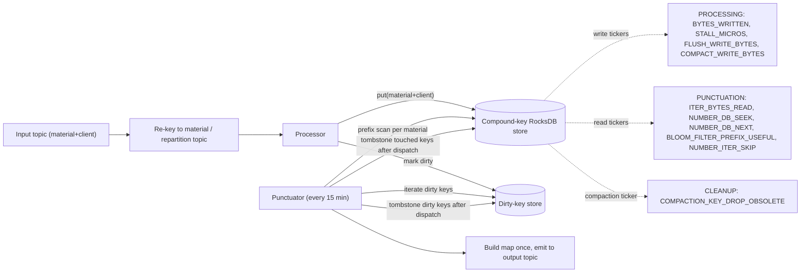
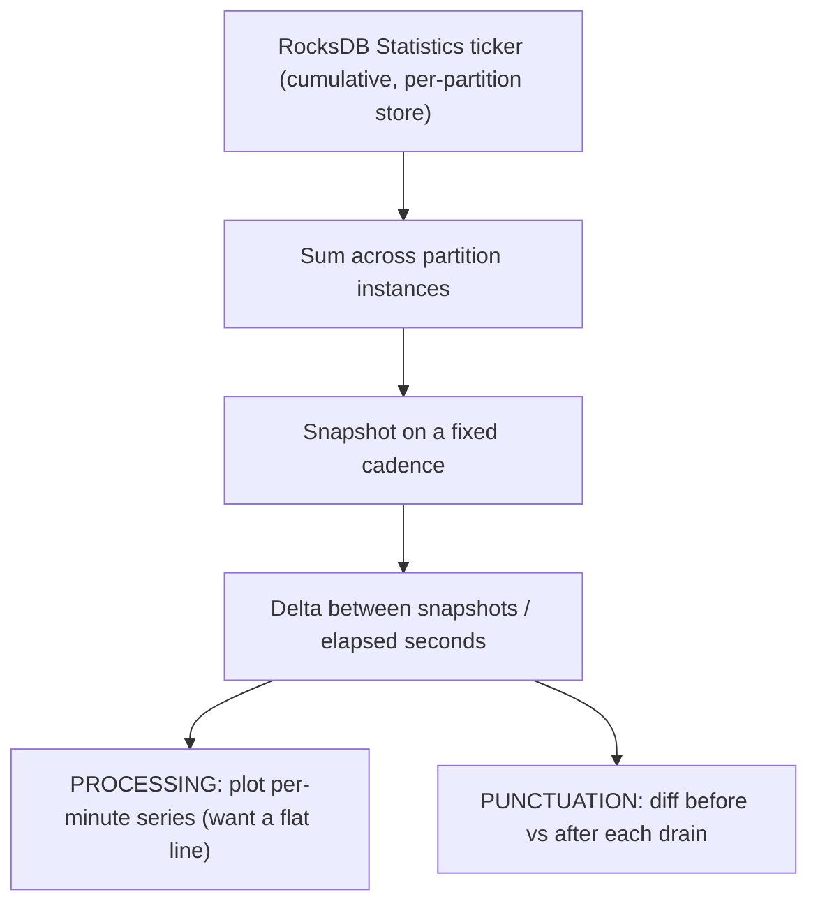

# Performance Testing the Prefix-Scan Repricing Pipeline

## RocksDB Metrics: What to Capture, Why, and How to Tune

### 1. What we are capturing and why

The goal of this test is twofold: **prove** that the new prefix-scan design scales where the old map-aggregation design did not, and **capture the signals we need to tune** RocksDB and the punctuation interval. We do this by reading RocksDB's own internal `Statistics` tickers directly (via a custom `RocksDBConfigSetter`), alongside the standard Kafka throughput and consumer-lag metrics we already collect. Two phases of each punctuation cycle matter, and each tells a different story.

**Processing interval (ingest).** Here we hope to see *flat, steady write throughput* across the entire interval, with effectively zero write-stall time. The old design failed precisely because per-record cost grew as the aggregated map grew, so throughput started very high and decayed over the interval. In the new design each inbound record is a small, independent write to a compound-keyed store, so we expect the throughput line to stay level from the first minute to the last. This is exactly why we must compute these numbers **minute by minute**: the failure mode is *temporal*. A single average over the 15-minute interval would completely hide a decay curve — the whole point is to confirm that minute 12 looks like minute 1, not to know the total.

**Punctuation interval (drain).** Here we hope to see a *short, sharp, efficient read burst*: we iterate the dirty material numbers, run one prefix scan per material, assemble each map once in memory, and dispatch. After each drain we tombstone the compound keys we touched this interval (a batched `putAll` of `(key, null)` pairs), so **both** the price store and the dirty-key store are wiped to empty for the next cycle — each holds only the current interval's delta, not cumulative state. Success means the scans read only the blocks they need (prefix Bloom filters doing their job) and the total drain stays well under `max.poll.interval.ms` so it never triggers a rebalance. Because the drain is a single burst rather than a sustained flow, we capture these numbers **per punctuation** (before/after the drain) rather than as a smoothed per-minute rate.

### 1a. Topology and data skew (current setup)

We currently run **one static node per partition** with no autoscaling, so each node owns exactly one store instance and per-node capture is a direct read of that instance's tickers; a cluster-wide number is simply the **sum across nodes**. The guidance below about summing tickers across multiple store instances only becomes relevant later, if we co-locate several partitions on one node.

Message arrival is **not evenly distributed** across partitions or across intervals — one node may take in far more (or far fewer) records in a given interval than its peers or than it did last interval. This does *not* change the **per-unit** cost we are testing: a single write is O(1) and a prefix scan is roughly proportional to the rows it returns, so **records-per-second and bytes-per-scan should stay flat whether a node handles 100 records or 1,000,000**. What *does* scale with volume is the **total work per interval**, and it surfaces in two places: a hot node generates more flush/compaction pressure (write stalls), and its punctuation drain scans more data (longer drain). Because the drain is single-threaded and blocks polling, the risk is that the **hottest** node's drain approaches `max.poll.interval.ms` and triggers a rebalance while quieter nodes look fine. Practically: normalize to **per-unit** figures (µs per record, bytes per scan, `NEXT ÷ SEEK` fan-out) so intervals of different sizes stay comparable, and always evaluate the **worst-case node**, not the average, against the stall and drain-time thresholds.

### 2. Processing interval — the write path

**Capture methodology.** Register one shared `org.rocksdb.Statistics` object in a custom `RocksDBConfigSetter` (wired via `rocksdb.config.setter`). Every ticker is a **cumulative, monotonic counter** read from the node's single store instance (see the topology note); a cluster-wide figure is the sum across nodes.

**Numbers to capture (minute by minute).**

- `BYTES_WRITTEN` — total uncompressed bytes written to the store; our headline write-throughput number.
- `STALL_MICROS` — time the writer spent blocked waiting on flush or compaction.
- `FLUSH_WRITE_BYTES` — bytes flushed from memtable to L0.
- `COMPACT_WRITE_BYTES` — bytes rewritten by compaction.

**Why they matter.** The `BYTES_WRITTEN` per-minute curve is the direct rebuttal to the old design's decay: if it stays flat, we have proven the scaling claim. `STALL_MICROS` is the ceiling indicator — if it stays near zero for the whole interval, RocksDB is not in our way and any slowdown lives elsewhere. The other two *explain* a stall when it happens: fast memtable turnover shows up as rising `FLUSH_WRITE_BYTES`, which forces compaction to catch up (rising `COMPACT_WRITE_BYTES`); when compaction can't keep pace, the writer stalls. Together they tell us whether a slowdown is a RocksDB write-amplification problem or an upstream one. One expectation to set before reading these numbers: because the store is emptied every interval, it never grows toward full-catalog size, so there is no multi-interval warm-up — a steady-state minute looks the same from the first interval onward. The one caveat is that each interval also writes a tombstone per touched key at cleanup; that churn surfaces as extra compaction load *between* drains (tracked on the read/maintenance side below), not as ingest-time writes.

**Compute step.** Per node, per-minute rate = ( ticker at *t* − ticker at *t*−60s ) ÷ 60. Derive write amplification as `COMPACT_WRITE_BYTES` delta ÷ `BYTES_WRITTEN` delta, and a **per-record cost** (`BYTES_WRITTEN` delta ÷ records processed that minute) so that a light interval and a heavy interval remain comparable despite skew. Plot each as a per-minute series across the interval — flat is good; a rising stall or compaction trend is the warning sign.

### 3. Punctuation interval — the read path

**Capture methodology.** Use the same `Statistics` object, but **snapshot the tickers immediately before and after each drain and take the difference**. We want per-punctuation figures, not a smoothed rate, because the drain is one burst event; a moving average would smear it across idle minutes. Most of these are per-drain read tickers; the exception is `COMPACTION_KEY_DROP_OBSOLETE`, which we diff **per interval**, because the compaction that reclaims our cleanup tombstones runs in the idle gap between drains rather than during the scan.

**Numbers to capture (per punctuation).**

- `ITER_BYTES_READ` — bytes (key + value) read *through the iterator*; the true prefix-scan read volume. (`BYTES_READ` counts only point `Get()`s and would badly understate us.)
- `NUMBER_DB_SEEK` — one seek per prefix scan, so this is the count of scans performed.
- `NUMBER_DB_NEXT` — iteration steps; `NEXT ÷ SEEK` gives average rows (client prices) per material — our fan-out.
- `BLOOM_FILTER_PREFIX_USEFUL` (with `BLOOM_FILTER_PREFIX_CHECKED`) — how often the prefix Bloom filter let a scan skip a file.
- `NUMBER_ITER_SKIP` — internal entries (tombstones and obsolete versions) the iterator steps over; under the delta model this is the drag left by the previous interval's cleanup, and must be read separately from `NUMBER_DB_NEXT`, which is real fan-out rather than waste.
- `COMPACTION_KEY_DROP_OBSOLETE` (per interval, not per drain) — deleted/overwritten keys that compaction actually reclaimed; confirms the cleanup tombstones are being reaped between drains rather than piling up.

**Why they matter.** This is the core bet of the new design: aggregation happens once per material via a cheap prefix scan instead of N read-modify-write cycles. `ITER_BYTES_READ`, `NUMBER_DB_SEEK`, and `NUMBER_DB_NEXT` quantify *how much work* the drain does; `BLOOM_FILTER_PREFIX_USEFUL` tells us whether that work is *efficient*. A low useful-to-checked ratio means scans are opening SST files they should have skipped — the difference between a fast drain and a rebalance-inducing one. Because both stores are emptied every interval, each drain leaves one tombstone per touched key and the *next* drain's prefix scan must step past them until compaction removes them. That makes `NUMBER_ITER_SKIP` a first-class read-path signal — tombstone drag on the scans, distinct from real fan-out — and `COMPACTION_KEY_DROP_OBSOLETE` its counterpart, confirming compaction cleared the prior interval's cleanup in the idle gap. Healthy is `NUMBER_ITER_SKIP` near zero at the *start* of each drain; the two are needed together because the skip count alone can't separate a compaction that is falling behind (fixable) from a genuinely large interval (see the tuning guide).

**Compute step.** Per drain: `iter_bytes` = `ITER_BYTES_READ` delta; `scans` = `NUMBER_DB_SEEK` delta; `fan_out` = `NUMBER_DB_NEXT` delta ÷ `NUMBER_DB_SEEK` delta; `filter_efficiency` = `PREFIX_USEFUL` delta ÷ `PREFIX_CHECKED` delta; `tombstone_drag` = `NUMBER_ITER_SKIP` delta, with `skip_ratio` = `tombstone_drag` ÷ `NUMBER_DB_NEXT` delta (the share of iteration wasted on dead entries). Per interval, compare the `COMPACTION_KEY_DROP_OBSOLETE` delta against the number of keys we tombstoned that interval — they should converge ~1:1 over successive intervals, and a persistent shortfall means tombstones are accumulating. Track the drain wall-clock separately (a custom timer around the punctuator) and watch it against `max.poll.interval.ms` — on the **busiest node**, since skew makes the hottest drain the one that gates rebalance risk.

### 4. Tuning guide

Read this as: **if we see X, we suspect Y, so we change Z in the RocksDB configuration.**

**Write path (processing interval)**

| If we see (X) | We suspect (Y) | Change (Z) |
|---|---|---|
| `STALL_MICROS` rising, pending compaction growing | Compaction can't keep up with ingest | Raise `max_background_jobs` / `max_subcompactions`; enable `level_compaction_dynamic_level_bytes` |
| Frequent small `FLUSH_WRITE_BYTES` churn | Memtable too small, turning over too fast | Raise `write_buffer_size` and `max_write_buffer_number` to absorb bursts |
| High write amplification (`COMPACT_WRITE_BYTES` ÷ `BYTES_WRITTEN`) | Too much rewriting across levels | Raise `target_file_size_base` / `write_buffer_size`; enable `compression` to cut I/O |
| `BYTES_WRITTEN` decays but `STALL_MICROS` ≈ 0 | Bottleneck is upstream, not RocksDB | Investigate changelog produce + (de)serialization, not RocksDB |

**Read path (punctuation interval)**

| If we see (X) | We suspect (Y) | Change (Z) |
|---|---|---|
| High `ITER_BYTES_READ` per scan, `PREFIX_USEFUL` ≈ 0 | Prefix Bloom not matching the key layout | Configure `prefix_extractor` for the material-number prefix; set `memtable_prefix_bloom_size_ratio` |
| High block-cache miss during drain | Cache too small or cold | Raise `block_cache_size`; set `cache_index_and_filter_blocks` + `pin_l0_filter_and_index_blocks_in_cache` |
| Very high `NEXT ÷ SEEK` ratio | Genuine large fan-out (many clients per material) | Larger `block_size` + read-ahead on the scan; otherwise accept as data shape |
| `NUMBER_ITER_SKIP` rising drain-over-drain, `COMPACTION_KEY_DROP_OBSOLETE` lagging the tombstones we wrote | Cleanup tombstones from emptying the stores each interval aren't reclaimed before the next scan | Force compaction in the idle window after dispatch (`compactRange`), or set `periodic_compaction_seconds` shorter than the interval; fewer/larger L0 files so tombstones drop sooner (the small dirty-key store can alternatively be held as an in-memory set to avoid its tombstones entirely) |
| `NUMBER_ITER_SKIP` high within a single drain even after compaction ran | Real per-interval churn is large, not a compaction lag | Accept as data shape, or revisit whether the full wipe must happen every interval |